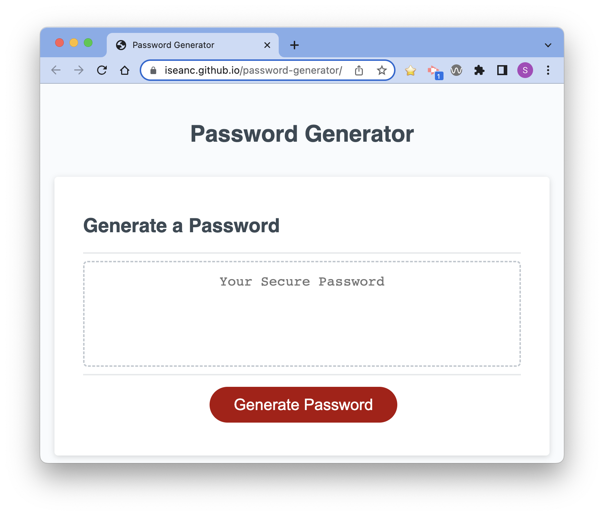
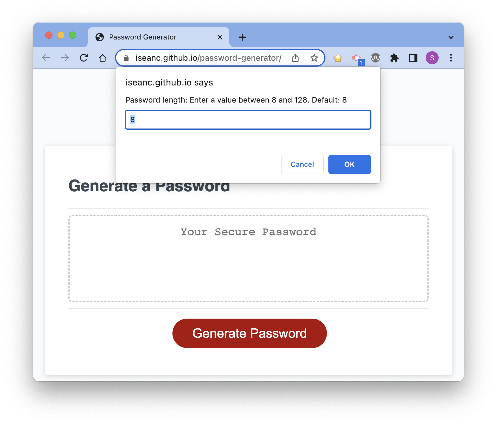
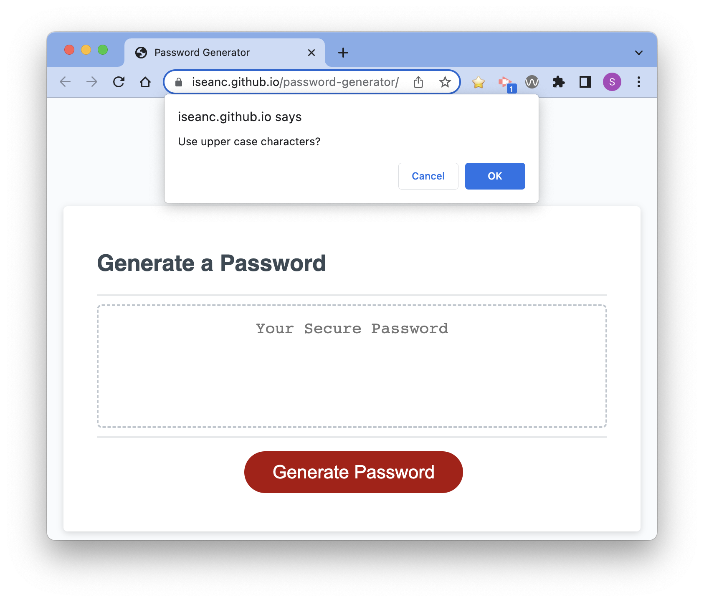
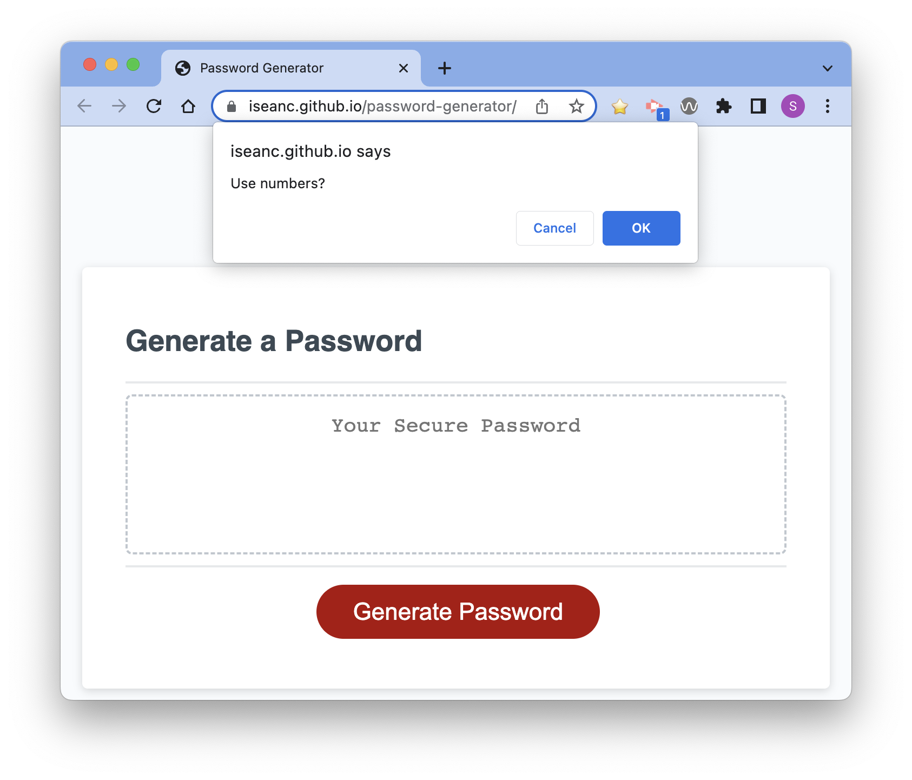

# Password Generator

## Description

Provide a short description explaining the what, why, and how of your project. Use the following questions as a guide:

This project provides a user the ability to generate random passwords of varying complexity.  This can improve the security of a user's password management scheme by eliminating use of potentially easy-to-guess passwords.  By allowing choices in password complexity, users can generate passwords that may meet varying complexity requirements on different security systems.  

This project is part of a web-development boot camp series of assignments.  The project includes use of function expressions, strings, arrays, random character generation, random function execution, event listeners, and updating web-page contents with JavaScript.

## Table of Contents

- [Deployment](#deployment)
- [Features](#features)
- [Usage](#usage)
- [Screenshots](#screenshots)
- [Credits](#credits)
- [License](#license)

## Deployment

This app [runs on the internet](https://iseanc.github.io/password-generator/)

**WARNING: I cannot guarantee the security of data copied from this site, should you choose to copy and use a password generated here.  I also cannot guarantee that the character restrictions the code assumes will match those of any live authentication system running anywhere in the world.**

## Features

- Generate a password between 8 and 128 characters in length.  Default length is 8 characters
- Choose from four complexity options: lower case characters, upper case characters, numbers (0 thru 9), and special characters.
- Special characters are listed at the [OWASP Password Special Characters page](https://owasp.org/www-community/password-special-characters). This tool does not use the space or double-quote characters.

## Usage

- Browse to [the Password Generator website](https://iseanc.github.io/password-generator/)
- Click "Generate Password"
- Enter the number of characters to generate.
- Click OK on the additional prompts to combine lower and upper case characters, numbers, and special characters in the password.  *NOTE: The generator will use all lower case letters, if you Cancel all prompts.
- Select and copy the password from the HTML page to your local clipboard.
- Click "Generate Password" to generate another password.

## Screenshots

## Credits

Special thanks to [this post on StackOverflow](https://stackoverflow.com/questions/42430401/how-to-call-a-random-function-one-time-in-javascript) for guidance on how to randomly execute one of multiple functions stored in an array.

## License

